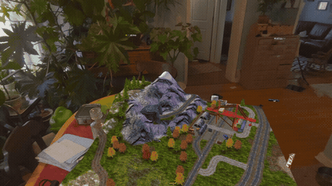
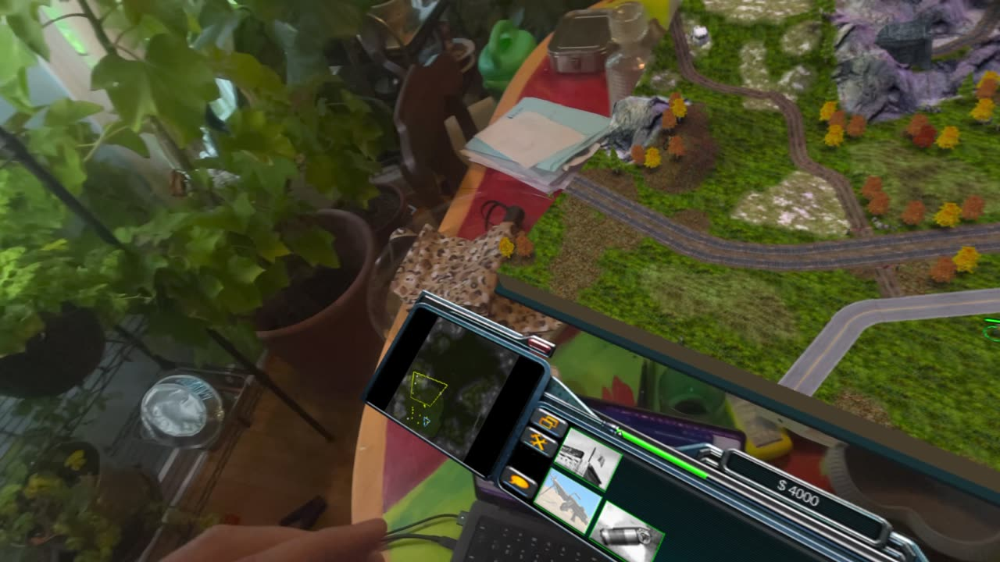
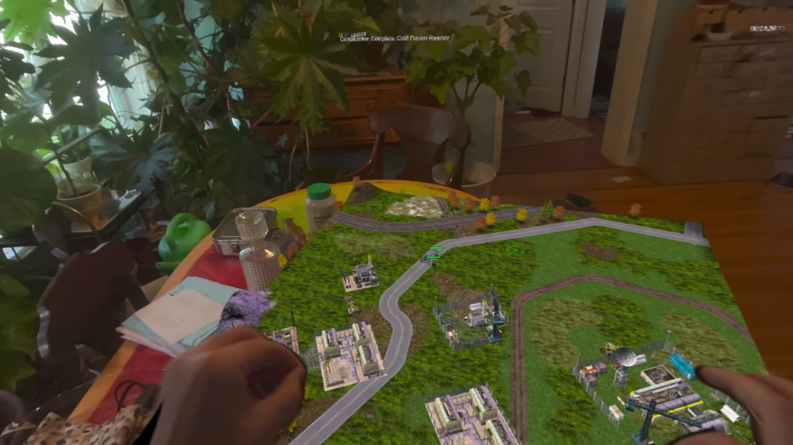
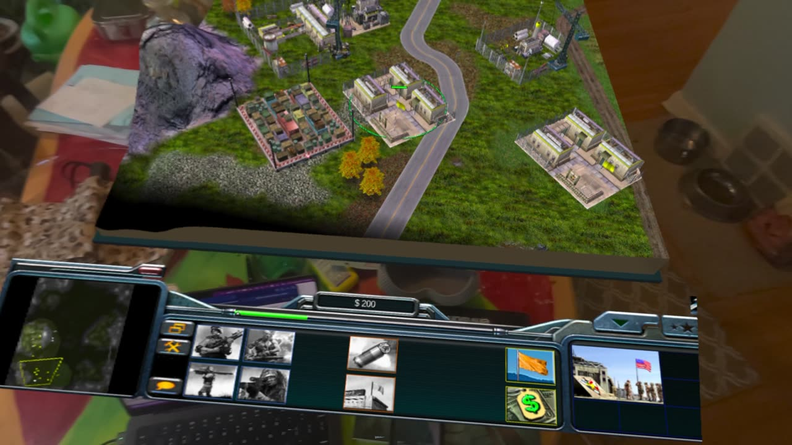
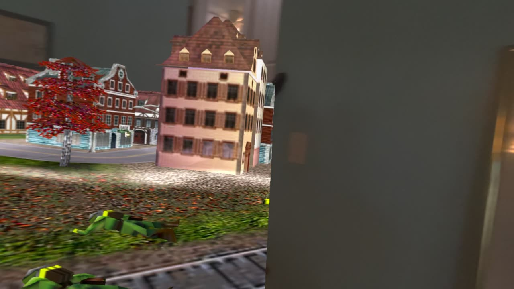

# Generals: Zero Hour for Apple Vision Pro

A native **visionOS** port of *Command & Conquer: Generals – Zero Hour*: the whole battlefield becomes a 3D miniature on your
real table, and you command it with your eyes and hands. Unofficial community project — not an Electronic Arts product.
You need your own copy of the game; no game files are included.

  

  
  

  
  

Recorded on Apple Vision Pro (visionOS 27 beta). Clips:
[select and move](docs/media/visionos/headset-select-move.mp4) ·
[battle](docs/media/visionos/headset-battle.mp4) ·
[Ground View](docs/media/visionos/headset-ground-view.mp4)

## What it is

- **A real 3D tabletop.** The original engine renders the map in stereo as a 1.1 m square miniature — terrain, units,
  buildings and effects — standing in your room with passthrough around it.
- **The real game.** Zero Hour's own engine runs natively on visionOS (GLES on Metal through ANGLE, on its own thread);
  the headset composites at 90 Hz while the game runs at its own pace.
- **The game's own HUD, rearranged for space.** The control bar (radar, money, build and unit buttons) lies in front of
  the table like a console; mission text and dialogs stand behind the far edge.
- **Native visionOS windows** for everything else: a small controls strip, a Commands window, Settings and Help.
- **Ground View.** Step down and walk the battlefield at human scale.
- **Bring your own data.** The app checks and uses your Generals + Zero Hour files; nothing is bundled.

## How the controls work

Apple never gives apps your gaze. The app gets a gaze ray only at the moment you pinch, and the **system** highlights what
you look at. The controls are built around that.

| Do this | Result |
| --- | --- |
| Look at a unit, pinch | Select it. The unit glows before you pinch (visionOS hover highlight). |
| Look at the ground, pinch | Move the selected units there. |
| Look at an enemy, pinch | Attack it. |
| Pinch, hold, see the ring | A coloured ring previews the result: **cyan** select, **green** move, **red** attack, **amber** enter/capture/repair. |
| Pinch, then nudge your hand (under 2 cm) | Correct the target before letting go — the ring follows your hand. |
| Pinch and drag on the map | Box select. |
| Pinch and drag the table edge | Pan the map. |
| Both hands pinch and spread | Zoom the map. |
| Grab bar in front of the table | Move, turn and resize the table (two hands). |
| Look at the control bar, pinch | Use the game's own buttons and minimap. |

**Controls strip** (a small window beside the table): Ground View, Recenter, Pause, Menu, Leave Tabletop · STOP,
Attack move, Guard, Scatter, All units, Deselect · Zoom in / Show more map · Add to selection · groups 1–5 ·
More commands (opens the full Commands window: orders, instant actions, selection, groups, tactics, map views).

Aim assist snaps a near miss onto the nearest unit (about 1.5°), because eye tracking is good to about a degree and units
on a table are small.

## What was built for this port

- Native visionOS shell: SwiftUI windows, immersive space, Compositor Services with a Metal compositor, stereo target
  ring shared with the engine through EGLImage and GPU fences.
- The engine as a static library for visionOS, with ANGLE (OpenGL ES 3 on Metal) and the Quest's GLES D3D8 backend.
- Gaze + pinch interaction: gaze-ray handling for how visionOS actually reports it, per-unit tracking areas with system
  hover, aim assist, hand refinement, colour-coded pinch preview, box select, pan, zoom, table move/turn/scale.
- Spatial layout: square table, control-bar console, far HUD band, per-pixel table depth for steadier reprojection.
- Game-data validator and importer (resumable, crash-safe), launcher, Commands/Settings/Help windows (English and German).
- Spatial audio listener that follows your head; OpenAL fix for visionOS.
- Host and simulator test suites (`scripts/qa/vision-run-all.sh`) and a detailed test matrix.

## Get it running

You need a Mac with Xcode 27, an Apple developer account, a Vision Pro in Developer Mode, and your own *Generals* and
*Zero Hour* game files. Step by step (build, pairing, installing, copying game data):
**[README_VISIONOS.md](README_VISIONOS.md)** and [docs/BUILD/VISIONOS.md](docs/BUILD/VISIONOS.md).

## Status

Early but playable on Vision Pro: the first campaign mission plays with look-and-pinch. Engine about 15–28 fps.
Not yet: skirmish setup, save/load, multiplayer, App Store. Known issues and next steps are in
[README_VISIONOS.md](README_VISIONOS.md#possible-improvements-from-the-first-headset-sessions); every feature and how it
was tested is in [docs/VISIONOS_TEST_MATRIX.md](docs/VISIONOS_TEST_MATRIX.md).

## Credits and license

Built on the Meta Quest tabletop edition by [Cesarus85](https://github.com/Cesarus85/Generals-Zero-Hour-XR)
([its README](README_QUEST.md)), which builds on the Android port ([tarek369](https://github.com/tarek369/GeneralsZH-Android)),
[GeneralsX](https://github.com/fbraz3/GeneralsX), [Fighter19](https://github.com/Fighter19/CnC_Generals_Zero_Hour) and
[TheSuperHackers](https://github.com/TheSuperHackers/GeneralsGameCode), and on EA's source release.

Engine source: GNU GPL v3 with EA's additional terms ([LICENSE.md](LICENSE.md)); this port uses the same terms. ANGLE is
BSD-3-Clause. *Command & Conquer*, *Generals* and *Zero Hour* are trademarks of their owners; nothing here grants rights to
them or to the game's data. Not made, endorsed or supported by Electronic Arts or Westwood Studios.
