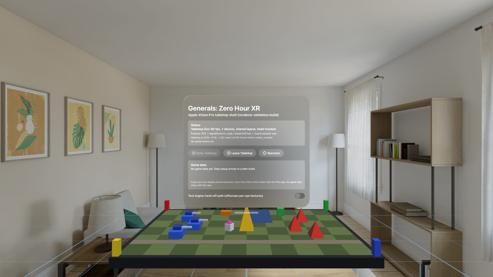

# Generals: Zero Hour XR for Apple Vision Pro (visionOS port, early development)

An unofficial, community effort to bring the tabletop edition of *Command & Conquer: Generals – Zero Hour* to Apple Vision Pro
as a native visionOS app. The Meta Quest 3 edition described in the main [README.md](README.md) remains the supported
release; this file covers the visionOS work only. This is not an Electronic Arts product and is not endorsed by EA.



The image above is the current shell running in the visionOS simulator. The checkerboard tabletop and coloured blocks are a
**renderer test scene**, not the game. Simulator capture, 2026-09-20.

## Status: a mission plays in the simulator; no device test yet

Be clear about where this stands. As of 2026-09-22:

| Area | State |
| --- | --- |
| Native app shell (SwiftUI window, immersive space, Compositor Services, Metal) | Working in the visionOS **simulator**, ~60 fps compositor |
| OpenGL ES 3.0 on Metal (ANGLE) for visionOS | Builds for simulator and device; smoke test and the real d3d8gles-on-ANGLE device test (90/90 checks) both pass in the simulator |
| The Zero Hour engine on visionOS | **Runs with real game data in the simulator** (the developer's own retail install, used in place, never committed). Main menu renders; campaign mission `MD_USA01` loads and shows as a stereo 3D miniature on a virtual table, with the engine HUD (radar, money, buttons) beside it. Engine about 12–15 fps in the simulator, compositor 60 fps |
| Engine/compositor architecture | Decoupled: the engine runs on its own thread at its own pace; the compositor thread presents at display rate independent of engine load. Soak-tested 340 s in the simulator: 60 fps compositor throughout, including through simulated engine stalls |
| Game data import and detection | Implemented and tested: a faithful C++ port of the Quest's archive validator (726 host checks), a resumable/atomic importer with crash recovery, screenshotted for every state in the simulator |
| Gameplay input | **Works in the simulator with an injected gaze ray**: look+pinch selects a unit, pinch on ground moves it, pinch-drag box-selects, drag on the board rim pans, pinch on the HUD minimap orders units there. The simulator gives no gaze ray of its own, so these runs use the `-testInput` hook (below). Not yet seen: attacking an enemy, building placement, two-hand table gestures |
| Presentation, UI, audio | Implemented and tested; the launcher now steps aside during a match so it does not block the board. Commands-window buttons were not pressed in a real match (simulator automation cannot tap SwiftUI windows) |
| Physical Apple Vision Pro | **Never tested.** No device has run this app |

The complete, evidence-backed list of every feature is in
[docs/VISIONOS_TEST_MATRIX.md](docs/VISIONOS_TEST_MATRIX.md) — read it before believing any summary here, including
this one.

The complete, evidence-backed list of every feature and its status is in
[docs/VISIONOS_TEST_MATRIX.md](docs/VISIONOS_TEST_MATRIX.md). The design, decisions and risks are in
[docs/VISIONOS_PORT_ARCHITECTURE.md](docs/VISIONOS_PORT_ARCHITECTURE.md). Nothing in this file should be read as a promise
of a release date or of feature parity with the Quest edition.

## What you need

| Requirement | Version |
| --- | --- |
| A Mac with Apple silicon | development was done on an M5 Mac with 32 GB |
| Xcode | 27.0 with the visionOS SDK 27.0 (`xros` and `xrsimulator`) |
| App deployment target | visionOS 26.0 (set in `visionos/project.yml`) |
| Simulator runtime | visionOS 26.5 is the only runtime the port has been tested on |
| CMake | 3.28 or newer (needed for the `visionOS` system name); 4.4.3 was used |
| vcpkg | a full clone, bootstrapped (shallow clones cannot resolve the manifest baseline) |
| XcodeGen | `brew install xcodegen` (the shell project is generated from `visionos/project.yml`) |
| git and python3 | used by the ANGLE build script |
| ANGLE for visionOS | built once by `scripts/build/visionos/build-angle.sh` (about 10 to 15 minutes per slice) |

Libraries are built for a minimum OS of 2.0; the app itself targets visionOS 26.0. Only the simulator has been used. A
physical Apple Vision Pro is required to check stereo, gaze and pinch, comfort and performance, and none was available.

## Quick start

The full instructions, presets and troubleshooting are in [docs/BUILD/VISIONOS.md](docs/BUILD/VISIONOS.md). The short
version, using only scripts that exist in `scripts/build/visionos/`:

```sh
# 1. Build ANGLE (OpenGL ES 3.0 on Metal) for the simulator and the device, once per machine.
#    Dependencies are checked out outside the repository; pass or export DEPS_ROOT to choose where.
scripts/build/visionos/build-angle.sh all

# 2. Build the app shell for the visionOS simulator (no signing needed).
scripts/build/visionos/build-shell.sh simulator --derived-data build/visionos-dd

# 3. Optional: an unsigned compile check against the device SDK (cannot be installed on a headset).
scripts/build/visionos/build-shell.sh device --derived-data build/visionos-dd-device

# 4. Run the shell in the simulator and capture screenshots. Use your own simulator device.
xcrun simctl create "GXR-mine" com.apple.CoreSimulator.SimDeviceType.Apple-Vision-Pro-4K com.apple.CoreSimulator.SimRuntime.xrOS-26-5
scripts/build/visionos/run-shell-simulator.sh --derived-data build/visionos-dd --out-dir build/visionos-shots \
    --udid <the-udid-printed-by-simctl-create> --wait 20 --shots 2
```

`build-shell.sh` builds the engine as a static library (target `z_generals`, option `SAGE_BUILD_VISIONOS_LIB`) and links
it into the app automatically when the merged `GeneralsZHEngine.xcframework` is missing; run
`scripts/build/visionos/build-engine.sh --simulator --device && scripts/build/visionos/make-xcframework.sh --simulator --device`
yourself first if you want to control that step, or pass `--no-build-engine` to `build-shell.sh` to skip it. Full detail
in [docs/BUILD/VISIONOS.md](docs/BUILD/VISIONOS.md). The run script defaults to a simulator UUID that belongs to the
original development machine; always pass `--udid` or set `GXX_VISIONOS_SIM_UDID` — **create your own simulator device**
(`xcrun simctl create GXR-mine com.apple.CoreSimulator.SimDeviceType.Apple-Vision-Pro-4K com.apple.CoreSimulator.SimRuntime.xrOS-26-5`;
the plain `Apple-Vision-Pro` type fails to create on some machines, use the `-4K` type) rather than sharing one — a
Metal crash in one client can kill every client on that simulator.

### Testing input in the simulator

The simulator's automated pinches reach the app with no gaze ray, so they cannot aim at the board. Use the
`-testInput` hook instead: it feeds pinch events with a gaze ray into the real input path (only the OS event source
is replaced).

```sh
SIMCTL_CHILD_GX_START_MAP='Maps\MD_USA01\MD_USA01.map' xcrun simctl launch <udid> com.generalsx.zerohour.xr.vision -autoImmersive -autoStartEngine -testInput
```

Then write commands to `<app data container>/tmp/gx-test-input.txt` (find the container with
`xcrun simctl get_app_container <udid> com.generalsx.zerohour.xr.vision data`). The app reads and deletes the file about
twice a second. `nx ny` are 0–1 across a simulator screenshot (x right, y down):

| Command | Effect |
| --- | --- |
| `tap nx ny` | look at that point and pinch |
| `drag nx0 ny0 nx1 ny1 [steps]` | pinch-drag from one point to the other (box select; a start on the board rim pans) |
| `mods <bits>` | modifier keys for the next events (1 = Shift, 4 = Option) |
| `wait <seconds>` | pause between commands |

Add `SIMCTL_CHILD_GX_DEBUG_INPUT=1` to log one line per pinch start and end (`[vision-input] ...`) in the engine log.
`GX_START_MAP` skips the menu and starts that map directly; without it, use the in-game menu.

The most useful launch arguments: `-autoImmersive` (open the immersive space automatically), `-fakeEngine` (run the
built-in GLES3 test scene through the exact same engine-thread/compositor pipeline the real engine uses, no game
data needed), `-fakeEngineScript` (a scripted loading → menu → tabletop → ground-view sequence), `-autoStartEngine`
(boot the real engine once game data is ready), `-allowNoData` (let you enter the tabletop with the test scene even
without game data), `-cycleImmersive N` (close/reopen the immersive space N times, for lifecycle testing), `-keepLauncher` (keep the
launcher window open during a match), `-testInput` (see above). See
[docs/visionos-shell.md](docs/visionos-shell.md) and [docs/visionos-engine-host.md](docs/visionos-engine-host.md).

Run `scripts/qa/vision-run-all.sh` (or add `--udid <your own simulator device>`) to reproduce this port's automated
test evidence in one command; see [docs/VISIONOS_TEST_MATRIX.md](docs/VISIONOS_TEST_MATRIX.md) for what each test proves.

## Game data

**No game data ships with this project and none ever will.** You must supply your own, legally owned copy of both
*Command & Conquer: Generals* and *Zero Hour*. The app and the repository contain no retail archives, maps, videos, fonts
or other copyrighted assets.

- Which files are needed, which installs are supported (Steam layout, installed discs) and how the app checks them:
  [docs/GAME_DATA_SETUP.md](docs/GAME_DATA_SETUP.md).
- The original file list for the Quest edition, which uses the same archives: [docs/HOWTO/GETTING_THE_GAME_FILES.md](docs/HOWTO/GETTING_THE_GAME_FILES.md).
- The importer is implemented: pick a folder (system file picker; a security-scoped "use in place" bookmark is also
  supported), the app validates it against the same 20-archive/marker-file/string-table rules as the Quest edition,
  then copies it into the app container with resumable, crash-safe, atomic import (verified: cancel-and-resume, and
  a real `kill -9` mid-copy followed by a clean recovery). Expect about 2.7 GB and several minutes.

## Running on a physical Apple Vision Pro

This procedure is documented but **has never been executed by the maintainers of this port**, who had no device. Treat it
as a starting point and correct it in the test matrix when you run it.

1. Use a Vision Pro registered to your Apple Developer account, with Developer Mode enabled and trusted by your Mac.
2. Generate the project: `scripts/build/visionos/build-shell.sh simulator` also runs XcodeGen, or run
   `xcodegen generate --spec visionos/project.yml`. This creates `visionos/GeneralsZHXR.xcodeproj` (git-ignored).
3. Open the project in Xcode, select the `GeneralsZHXR` target, and under Signing & Capabilities choose **your own team**.
   Do not commit team identifiers or provisioning files. Bundle identifier: `com.generalsx.zerohour.xr.vision`
   (change it if your team needs a different one).
4. Choose your Vision Pro as the run destination and press Run. From the command line the equivalent is
   `xcodebuild -project visionos/GeneralsZHXR.xcodeproj -scheme GeneralsZHXR -destination 'generic/platform=visionOS' DEVELOPMENT_TEAM=<your team> build`
   followed by `xcrun devicectl list devices` and `xcrun devicectl device install app --device <device> <path to GeneralsZHXR.app>`.
5. Do not use `devicectl device copy to ... --remove-existing-content true` on the app container: it removes all app data,
   including any game data you copied.

The unsigned `device` build in step 3 of the quick start only proves that the code compiles for the device SDK.

## Controls

Controls for the tabletop. The routing from gesture to engine call is unit-tested against a recording fake of the
engine bridge, and since 2026-09-22 several controls have been driven against a real running mission in the
simulator with an injected gaze ray (`-testInput`). **Real gaze and hands on a device are not tested.** The design and the reasoning (gaze is
never continuous on visionOS, so a ray arrives only when a pinch begins) are in
[docs/visionos-interaction.md](docs/visionos-interaction.md), which is the authoritative reference and may change these.

| Gesture | Intended action | State |
| --- | --- | --- |
| Look at a unit or a point on the map, then pinch | Select a unit, or give the context order (move, attack) to the selected units | select and move work in a real mission (simulator, injected ray); attack not yet seen |
| Pinch, hold and drag across the board | Box selection | works in a real mission (simulator, injected ray) |
| Pinch, hold and drag from the board rim | Pan the map | works in a real mission (simulator, injected ray) |
| Look at the HUD (radar, buttons) and pinch | Press that part of the engine HUD | minimap works (orders the selection there); other buttons not confirmed |
| Grab bar at the board edge, pinch and drag | Move the tabletop | math implemented + unit-tested; never driven by real input |
| Both hands pinching, spread or twist | Scale and rotate the tabletop | math implemented + unit-tested; never driven by real input |
| Look at the ground and pinch after choosing a building | Preview, then place; a rotate gesture and cancel are part of the design | routing implemented; placement-legality query is an open item (see the test matrix) |
| Ground View: choose a ground spot to teleport there | Human-scale view of the battlefield; a matching exit gesture returns to the tabletop | full plumbing implemented and visually verified with synthetic data; never used with real terrain |
| Recenter, HUD ornament (Ground View toggle, Pause, Leave Tabletop, Windows → Open Launcher) | Place the tabletop in front of you again / quick actions | implemented, opens without crashing in the simulator |

## Known problems

- **Only part of the game has been played.** One campaign mission loads and takes orders in the simulator. Attacking,
  building placement, skirmish setup, save/load and audio have not been checked with real data yet.
- **Nothing has been tested on a real Apple Vision Pro.** Stereo (two eyes), comfort, thermals, frame rate, memory,
  real gaze and hand tracking, and plane/table detection are all unknown. The simulator renders a single view, has
  no hand tracking or plane detection, and sends automated pinches without a gaze ray.
- Loading a mission takes about 3–4 minutes in the simulator.
- ANGLE has no multiview and no S3TC/DXT texture formats; textures are decoded on the CPU (verified correct, 48/48
  format checks) — its cost with real game textures is unmeasured. Route B (a native Metal D3D8 backend) remains
  the documented fallback if ANGLE proves too slow on device.
- Multiplayer/LAN is not wired up on visionOS yet (GameNetworkingSockets builds for both slices, but no session
  source exists); the Quest LAN synchronisation problem in
  [docs/WORKDIR/planning/MULTIPLAYER_STATUS.md](docs/WORKDIR/planning/MULTIPLAYER_STATUS.md) applies here too, and
  is intentionally deprioritised behind skirmish per the engineering priority order.
- See `docs/VISIONOS_TEST_MATRIX.md`'s "Known bugs / open items" section for specific, unclosed defects found during
  this session's own testing (a placement-legality query, a Settings-page screenshot gap, and a SwiftUI ornament/
  `@Environment` crash class already fixed in the three places it was found).
- The ANGLE build uses a vendored copy from WebKit's tree with a small patch. It is a development dependency, not yet a
  reviewed redistributable.
- Distribution outside your own devices (TestFlight, App Store) has not been analysed, including how GPLv3 and the store
  terms interact. Do not assume it is possible.

## Legal and lineage note

This is a community project. It is **not** made, endorsed or supported by Electronic Arts, Westwood Studios or any
rights holder. *Command & Conquer*, *Generals* and *Zero Hour* are trademarks of their owners; the source licence does not
grant rights to those trademarks, and nothing here grants rights to the game's data.

- The engine source was released by EA under the GNU General Public License v3 with additional terms; see
  [LICENSE.md](LICENSE.md). This port is distributed under the same terms.
- Lineage: EA's source release, then the community work of [TheSuperHackers](https://github.com/TheSuperHackers/GeneralsGameCode)
  and [Fighter19](https://github.com/Fighter19/CnC_Generals_Zero_Hour), then [GeneralsX](https://github.com/fbraz3/GeneralsX)
  (macOS and Linux native), the iOS and iPadOS port in the generals-2026 tree, the Android port by
  [tarek369](https://github.com/tarek369/GeneralsZH-Android) and its [Cesarus85 fork](https://github.com/Cesarus85/GeneralsZH-Android),
  and the Quest tabletop edition in this repository. The visionOS port builds on that work. The full description is in
  [docs/VISIONOS_PORT_ARCHITECTURE.md](docs/VISIONOS_PORT_ARCHITECTURE.md), section 1.
- ANGLE (OpenGL ES on Metal) is BSD-3-Clause licensed; its licence text is installed beside the libraries and must ship
  with any binary that includes them.
- Never add, download or fabricate copyrighted assets. Contributions that bundle retail game files will not be accepted.

## Where to look next

- [docs/VISIONOS_TEST_MATRIX.md](docs/VISIONOS_TEST_MATRIX.md): what works, with evidence, and how to update it.
- [docs/VISIONOS_PORT_ARCHITECTURE.md](docs/VISIONOS_PORT_ARCHITECTURE.md): lineage, component map, route decision, threading,
  frame sequence, coordinate systems, interfaces, risk register.
- [docs/visionos-shell.md](docs/visionos-shell.md): the app shell as it exists today.
- [docs/BUILD/VISIONOS.md](docs/BUILD/VISIONOS.md), [docs/GAME_DATA_SETUP.md](docs/GAME_DATA_SETUP.md),
  [docs/visionos-interaction.md](docs/visionos-interaction.md): build, data and controls references.
