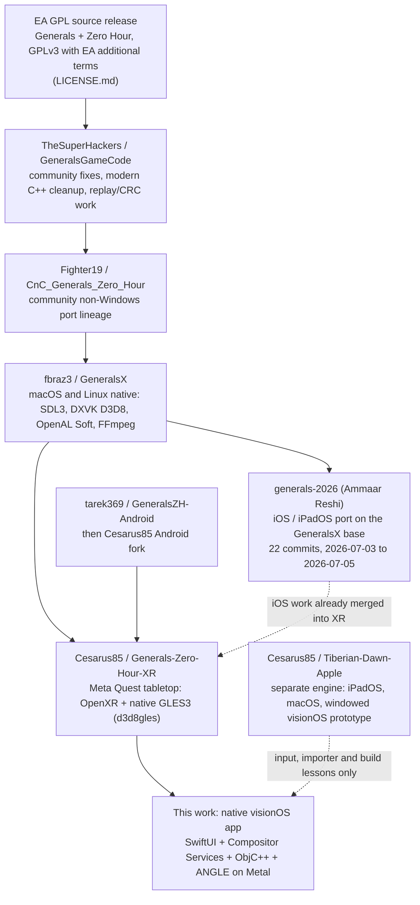
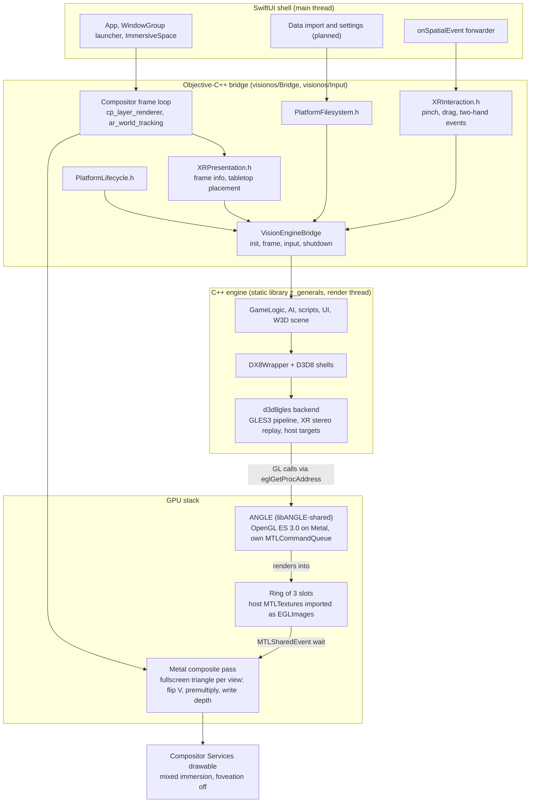
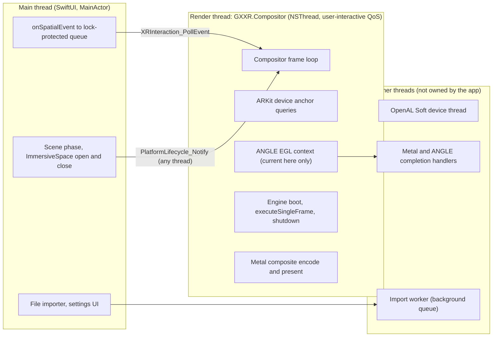
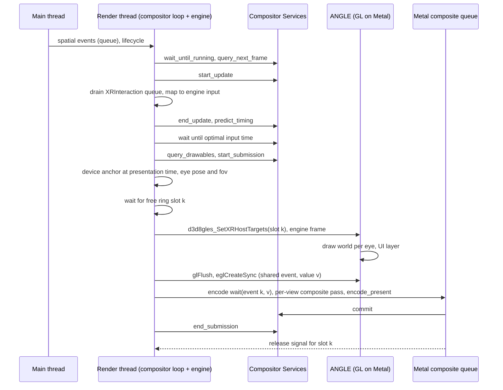

# Generals: Zero Hour XR on Apple Vision Pro: Phase 1 architecture

Status: Phase 1 design and evidence baseline. Written 2026-09-20 on branch `vp/h-docs` (base commit `039512c`).
Companion documents: [VISIONOS_TEST_MATRIX.md](VISIONOS_TEST_MATRIX.md) (what works, with evidence),
[../README_VISIONOS.md](../README_VISIONOS.md) (user-facing status), [visionos-shell.md](visionos-shell.md) (the app shell).

This document does three jobs. It records where the code came from and what a native visionOS build has to change
(sections 1 to 3). It explains and justifies the rendering and presentation route that was chosen, and the fallback
(sections 4 and 5). It specifies the runtime: threads, frame sequence, coordinate systems, interfaces and risks
(sections 6 to 12).

Nothing here claims that the game runs on visionOS. At the time of writing only the app shell, the ANGLE build and
an engine link probe exist and have been run; no game data has ever been loaded on this port and no physical Apple
Vision Pro has been used. Section 13 lists exactly what has and has not been verified.

## 0. Evidence tags

Every non-obvious statement carries one of these tags, so a reader can tell reading from running.

| Tag | Meaning |
| --- | --- |
| `[src]` | Read in this repository at the cited `path:line` (paths are repo-relative). |
| `[built]` | Compiled or linked by a build that was actually run (procedure given where it matters). |
| `[ran]` | Executed and the output observed (simulator or macOS). |
| `[doc]` | Taken from Apple documentation, an SDK header or a third-party source that was read but not run. |
| `[est]` | An engineering estimate. Not measured. |
| `[unv]` | Unverified. Stated as a working assumption; needs a device or more work. |

Line numbers refer to the tree at base commit `039512c`. Paths under `$DEPS_ROOT` are dependency checkouts that live
outside the repository (see `scripts/build/visionos/build-angle.sh` for the default and the override variable).

## 0.1 Supported SDK and OS statement

| Item | Value |
| --- | --- |
| Toolchain | Xcode 27.0, visionOS SDK 27.0 (`XROS27.0.sdk`, `XRSimulator27.0.sdk`) |
| App deployment target | visionOS 26.0 (`visionos/project.yml`, `deploymentTarget.visionOS`) `[src]` |
| Native libraries | Built with minimum OS 2.0 (`XROS_DEPLOYMENT_TARGET=2.0`; ANGLE slices verified with `vtool`: platform 11 device, platform 12 simulator, minos 2.0, sdk 27.0) `[built]` |
| Tested on | visionOS Simulator runtime 26.5 only (the only runtime installed on the development machine) `[ran]` |
| Physical device | None. No Apple Vision Pro has run this app. Everything that needs a headset is marked `[unv]` or "not tested". |
| visionOS 27-only APIs | Not used. Anything newer than 26.0 must be guarded with availability checks and cannot be run on the available runtime (for example `LowLevelDeviceResource`, section 4.2). |
| CMake | 3.28 or newer is required for the `visionOS` system name (`CMAKE_SYSTEM_NAME=visionOS`); 4.4.3 was used `[built]` |

## 1. Repository lineage

This is a stack of community ports of the same game. Knowing which layer owns which code explains most of the
`#if` structure found in the engine.



- **EA source release.** Electronic Arts published the Generals and Zero Hour source under GPLv3 with additional terms
  (`LICENSE.md`). The source licence does not grant rights to EA trademarks or to the retail game data.
- **TheSuperHackers and Fighter19.** Community maintenance of the released source and its non-Windows ports. Comments
  such as `TheSuperHackers @bugfix` in the tree (for example `Core/GameEngine/Source/Common/FramePacer.cpp:61`) mark
  their contributions.
- **GeneralsX (fbraz3).** The macOS and Linux native port. It contributes the SDL3 device layer, the DXVK D3D8 route
  (`Core/Libraries/Source/WWVegas/WW3D2/dx8wrapper.cpp:783-800`), OpenAL Soft with FFmpeg, and the `GeneralsX @...`
  comment convention seen throughout.
- **generals-2026 (Ammaar Reshi).** The iOS and iPadOS port, built on GeneralsX. Recon comparison of that tree
  against this one found this tree to be a strict superset for Apple work: the single import commit `b99838b`
  (2026-09-14) already contains every iOS fix, and the iOS guard `TARGET_OS_IPHONE` was generalised to
  `SAGE_MOBILE_PLATFORM` (`GeneralsMD/Code/GameEngineDevice/Source/SDL3GameEngine.cpp:82`) `[src]`. Nothing needs to be
  merged back from it.
- **Android and Quest (tarek369, then Cesarus85).** The Android port (`android/`, JNI, the GLES3 backend
  `Core/Libraries/Source/d3d8gles`) and the Quest tabletop layer (`GeneralsMD/Code/Main/XrHello.cpp`, `XrGameBoot.cpp`
  and about 40 `Xr*.h` headers). The Quest edition is the immediate parent of this port and the source of nearly all
  reusable XR logic.
- **Tiberian-Dawn-Apple (Cesarus85).** A different engine (Vanilla Conquer). It contains a windowed visionOS prototype
  that has run on a physical Vision Pro. It is a source of lessons, not of code: its build recipe, importer and
  gesture state machine are useful; its UIKit/SDL window approach does not apply to an immersive Compositor Services
  layer. Its own author found a raw pointer mapping unreliable on hardware, which matches what the Quest code
  concluded (`GeneralsMD/Code/GameEngineDevice/Include/SDL3Device/GameClient/TouchInput.h`, "no synthesized pointer").
- **This work.** The visionOS port started on the branch `visionos-port` on 2026-09-20 with the app shell
  (`c0aee5b`) and the ANGLE build script (`039512c`).

Attribution and licensing obligations are described in the README section "Legal and lineage note"
([../README_VISIONOS.md](../README_VISIONOS.md)).

## 2. Design constraints (settled)

These were decided before this document and are not reopened here. Sections 4 and 12 explain the reasoning and the
conditions under which the fallback would be used.

1. Keep the engine's native GLES3 D3D8 backend (`Core/Libraries/Source/d3d8gles`) and run it on ANGLE's Metal
   backend. No DXVK, no MoltenVK, no `OpenGLES.framework` (unavailable on visionOS, section 3.3).
2. Present through a Compositor Services `CompositorLayer` in an `ImmersiveSpace`: mixed immersion, `.dedicated`
   layout (fallback `.shared`), foveation off, premultiplied alpha, reverse-Z depth.
3. Build the engine as the static library target `z_generals` (option `SAGE_BUILD_VISIONOS_LIB`, `CMAKE_SYSTEM_NAME=visionOS`)
   linked into the Swift app. The host drives frames: there is no main loop and no SDL window. Macros:
   `GX_PLATFORM_VISIONOS` (defined by CMake), `GX_XR_HOST = defined(__ANDROID__) || defined(GX_PLATFORM_VISIONOS)` guarding the existing
   Quest XR hooks, `GX_USES_D3D8GLES = defined(__ANDROID__) || defined(GX_D3D8GLES_BACKEND)`. On visionOS
   `TARGET_OS_IPHONE == 1` and `TARGET_OS_VISION == 1` while `TARGET_OS_IOS == 0` `[src]`
   (`XROS27.0.sdk/usr/include/TargetConditionals.h:185-194`).
4. One render thread owns the ANGLE context and runs the engine frame. Engine singletons are not restart-safe: boot
   once per process (`android/app/src/main/java/com/generalsx/zerohour/XrHelloActivity.java`, `onDestroy` ends the process).
5. Quest and Android support must remain. Shared-code changes are additive and gated; no Quest code is deleted.
6. The engine's own command logic is reused. Game rules are never re-implemented in Swift or in the host.
7. Retail game data is never bundled, downloaded or fabricated. The player supplies a legally owned Generals and
   Zero Hour installation.

## 3. Architecture map

### 3.1 Component disposition

Legend for the "Disposition" column.

- **Unchanged**: compiled as is, no behavioural edit expected.
- **Adapted**: same code, widened guards or new inputs, or a small additive change.
- **Replaced**: the Quest or Android implementation is substituted by a new visionOS one behind the same contract.
- **New**: does not exist in the tree today.
- **Retained**: stays in the tree for Quest/Android, not built for visionOS.

"State" says what exists today: **done** (built or run, evidence given), **specified** (contract fixed, implementation
in progress on parallel branches, not verified here), **planned** (not started).

| Component | Disposition | On visionOS | State and evidence |
| --- | --- | --- | --- |
| Core simulation (GameLogic, AI, ScriptEngine, Xfer, CRC) | Unchanged | No platform code beyond Windows-only blocks (`GeneralsMD/Code/GameEngine/Source/GameLogic/System/GameLogic.cpp:32,220`). Determinism flags (`-ffp-contract=off`) apply to every non-MSVC compiler already. | Compiles and links for xrsimulator arm64 (probe) `[built]`. Never executed on this port. |
| Game loop and frame pacing | Adapted | The host calls one `executeSingleFrame()` per host frame (Quest model, `GeneralsMD/Code/Main/XrGameBoot.cpp:439-466`) and must enable the logic time scale. See 3.2. | Specified. Logic time scale risk is open (R1). |
| Rendering abstraction D3D8 to d3d8gles to ANGLE-Metal | Adapted | `DX8Wrapper::Init()` picks `Direct3DCreate8_GLES` (`Core/Libraries/Source/WWVegas/WW3D2/dx8wrapper.cpp:750-766`); the backend gets a resolver-based GL loader and host-supplied render targets. GL entry points come from ANGLE's `eglGetProcAddress`. | Specified (host-targets contract, section 9.6). ANGLE builds and its smoke test passes in the simulator `[ran]`. |
| OpenGL, Vulkan and DirectX dependencies | Adapted (GL) / Not used (Vulkan, DirectX runtime) | GL: ANGLE (ES 3.0 only). Vulkan, DXVK, MoltenVK and Vulkan SDK are not needed. DXVK's D3D8 header set is still needed at compile time (`d3d8.h` lives in its `include/native/directx` submodule). Direct3D 8 is only an API vocabulary here; no D3D runtime exists. | Header-only DXVK checkout was enough to compile 730 engine steps for xrsimulator `[built]`. |
| Quest-specific code (`Xr*.h`, layout, Ground View state, tactics) | Adapted | The 29 pure-logic headers (`GeneralsMD/Code/Main/XrPlacement.h`, `XrWorld.h`, `XrTactics.h`, `XrLayers.h`, ...) depend on OpenXR only for six POD math types, so a small types shim is enough. `XrHello.cpp` is not reused. | 31 of 40 host tests build and pass on macOS `[ran]` (see test matrix). |
| OpenXR code (`XrHello.cpp`, `XrControls.h`, `XrScene.h`) | Replaced | Compositor Services (`cp_*`) for frames and views, ARKit (`ar_*`) for the device anchor, spatial events and later hand and plane providers. | Shell implements the frame loop, head pose and placement `[ran]` (`visionos/Bridge/GXXRBridge.mm`). Hand and plane providers planned. |
| Android code (`android/`, `AndroidCrashHandler.cpp`, adrenotools, Gradle) | Retained | Untouched. Not part of any visionOS target. | n/a |
| JNI code (`XrGameBoot.cpp` storage getters, `SDL3Main.cpp:356-358`, Java panels) | Replaced | Objective-C++ (`visionos/Bridge`, `visionos/Platform`) provides storage paths, logging and lifecycle. `XrGameBoot.cpp:220` `XrGameBoot_Init(JNIEnv*, jobject, ...)` needs a non-JNI twin. | Filesystem and lifecycle bridges exist in the shell; the engine boot twin is specified. |
| Input abstraction | Adapted + New | Quest: fake-mouse events through `SDL3Mouse::addSDLEvent` and `TouchInput` direct engine calls (`XrGameBoot.cpp:1491-1543`; `GeneralsMD/Code/GameEngineDevice/Source/SDL3Device/GameClient/TouchInput.cpp`, 497 lines, no JNI in its logic). visionOS: a platform-neutral event stream (`visionos/Platform/XRInteraction.h`) feeds the same engine entry points. | Event stream implemented and compiled; never fed real gaze or pinch events `[built]`. |
| XR camera code (board mapping, eye clip matrices) | Unchanged | `GX_XR_BeginStereoWorld` (`XrGameBoot.cpp:664`) builds game-to-board and per-eye clip matrices from `XrWorldFrame` (`GeneralsMD/Code/Main/XrWorld.h`). Only the data source changes: eye poses and fov now come from Compositor Services views. | Specified. |
| Stereo rendering | Adapted | Quest default is OVR_multiview; ANGLE-Metal has none. The backend already has a separate-target and an atlas mode (`Core/Libraries/Source/d3d8gles/src/gles_pipeline.cpp:2823-2895`); visionOS forces atlas or separate mode. | Simulator gives one view only, so two-view stereo is verified only by construction (R4). |
| Framebuffer and render-target handling | Adapted | Backend-owned FBOs and textures stay; eye colour targets become host-owned `MTLTexture`s imported as EGLImages and injected per frame. Depth stays private (D24S8). | Specified. |
| UI rendering (2D engine UI) | Unchanged | The engine's 2D UI draws into the MRT UI attachment (`gles_pipeline.cpp:2993-3038`). The Quest Java panel painter (`XrPanelPainter.java`) is replaced by CoreGraphics or SwiftUI. | Engine path unchanged. Panel replacement planned. |
| Terrain rendering | Unchanged | Same `HeightMap` and `d3d8gles` draw path; stereo replays each draw per eye. DXT terrain textures are software-decoded when S3TC is absent (`gles_pipeline.cpp:1247-1379`), costing 4x memory. | Compiles. Not run. Memory impact open (R5). |
| Unit rendering | Unchanged | Same W3D draw calls; board-box culling `GX_XR_CullSphere` (`GeneralsMD/Code/GameEngineDevice/Source/W3DDevice/GameClient/W3DScene.cpp:467`) must be widened to `GX_XR_HOST`. | Not run. |
| Particle and effect rendering | Unchanged | Point groups baked into view space use the `uXrCamera` path in the stereo vertex shader. | Not run. |
| Audio | Adapted | OpenAL Soft (patched CoreAudio backend for visionOS) plus FFmpeg. Head pose must drive the AL listener (`OpenALAudioManager::setDeviceListenerPosition`, `Core/GameEngineDevice/Source/OpenALAudioDevice/OpenALAudioManager.cpp:2963`). AVAudioSession handling is new. | Patched OpenAL compiles and links for xrsimulator `[built]`. Never run. |
| Filesystem abstraction | Adapted + New | Engine reads `.big` archives from the working directory via `StdBIGFileSystem`/`StdLocalFileSystem` and the env-var protocol. The shell provides `PlatformFilesystem` (app data, caches, game data, security-scoped bookmark). | Filesystem bridge implemented (`visionos/Bridge/GXXRPlatformFilesystem.mm`). Engine wiring specified. |
| Threading | Adapted | One render thread owns ANGLE and the engine; main thread only forwards input and lifecycle. See section 6. | Compositor thread exists in the shell; engine thread wiring specified. |
| Networking | Adapted (build) | Logic unchanged. GeneralsOnline code includes GameNetworkingSockets headers unconditionally (`GeneralsMD/Code/GameEngine/Include/GameNetwork/GeneralsOnline/NetworkMesh.h:7`) while linking is gated to Android (`GeneralsMD/Code/GameEngine/CMakeLists.txt:1245`), so visionOS needs the dependency built (probe did) or a stub. LAN needs the local-network usage description. | Compiles with GNS built through vcpkg overlay ports `[built]`. Never run. |
| Save and load | Unchanged | `XferSave` uses `fopen` (`Core/GameEngine/Source/Common/System/XferSave.cpp:123`); saves live under the user data directory. The Apple branch of `BuildUserDataPathFromRegistry` resolves to `$HOME/Library/Application Support/GeneralsX/GeneralsZH` (`GeneralsMD/Code/GameEngine/Source/Common/GlobalData.cpp:1514-1526`), and `HOME` is the app container on visionOS. | Not run. |
| Game-data loading | Unchanged (engine) + New (validator, importer) | `StdBIGFileSystem::loadBigFilesFromDirectory` (`Core/GameEngineDevice/Source/StdDevice/Common/StdBIGFileSystem.cpp:651`) scans recursively, case-insensitively (`StdLocalFileSystem.cpp:282-341`). Detection, import and access are new host work; see [GAME_DATA_SETUP.md](GAME_DATA_SETUP.md). | Placeholder presence check only. No real data has been used. |
| Build system | Adapted | New visionOS branches in `cmake/sdl3.cmake`, `Core/Libraries/Source/WWVegas/WW3D2/CMakeLists.txt`, `GeneralsMD/Code/Main/CMakeLists.txt`, vcpkg triplets and overlay ports, presets. See [BUILD/VISIONOS.md](BUILD/VISIONOS.md). | Engine and all dependencies linked for xrsimulator in a probe tree `[built]`; repository changes are on parallel branches. |
| Existing iOS and macOS code | Adapted | `TARGET_OS_IPHONE` C++ branches turn on for visionOS by themselves (10 files; list in 3.3); CMake `iOS` checks do not. The Apple `dx8wrapper.cpp:783-800` DXVK branch must be ordered after a visionOS branch. | Audit list below. |
| SDL dependencies | Adapted | SDL3 is needed only for events, timers and iconv (`XrGameBoot.cpp:363-371` model). It builds for visionOS as a static library only with `SDL_VIDEO=OFF` (its UIKit driver does not compile against the visionOS 27 SDK). | `libSDL3.a` built in about 34 s `[built]`. |
| Objective-C and Apple code | New | SwiftUI app, ObjC++ Compositor loop, Metal composite renderer, input normaliser. | 2,730 lines under `visionos/`; builds for simulator and unsigned device `[built]`. |

### 3.2 The frame-pacing and logic-time-scale risk

This is the most important non-rendering finding. It was read from code and has not been tested.

- The engine's logic step is 30 Hz (`BaseFps = 30`, `Core/GameEngine/Include/Common/GameCommon.h:67`;
  `WWSyncPerSecond = 30`, `Core/Libraries/Source/WWVegas/WWLib/WWCommon.h:70`).
- The 2D game loop enables a render frame limiter (`GeneralsMD/Code/GameEngine/Source/Common/GameMain.cpp:43-44`).
  The Quest XR host deliberately does not, because a sleep inside `executeSingleFrame` would stall the compositor
  loop (`GeneralsMD/Code/Main/XrGameBoot.cpp:404-407`).
- `FramePacer` starts with both the render limiter and the logic time scale disabled
  (`Core/GameEngine/Source/Common/FramePacer.cpp:41-45`). The only callers that change the logic time scale are the
  in-game time-scale key handler (`Core/GameEngine/Source/GameClient/MessageStream/CommandXlat.cpp:234-242`, disabled in
  network games) and the pause bookkeeping that restores a previous state (`GeneralsMD/Code/GameEngine/Source/GameLogic/System/GameLogic.cpp:4500,4539`).
  Nothing enables a 30 Hz logic scale for a host that has no render limiter `[src]`.
  `FramePacer::getActualLogicTimeScaleFps` therefore returns the uncapped value 1,000,000
  (`Core/GameEngine/Source/Common/FramePacer.cpp:174-197`), and `GameEngine::canUpdateRegularGameLogic` returns true
  immediately when the logic rate is at least the render limit (`GeneralsMD/Code/GameEngine/Source/Common/GameEngine.cpp:1011-1040`).
- Consequence on paper: every host frame executes one logic step. At 90 Hz that is 3 times the intended game speed; at
  72 to 120 Hz it is about 2.4 to 4 times. The Quest edition's measured frame times (20.7 to 42.0 ms,
  `docs/WORKDIR/planning/XR_CURRENT_STATUS.md:59,96-98`) are close to the 33.3 ms logic step in heavy scenes, which may
  have hidden the effect there. Whether Quest game speed is exactly right is not recorded in the repository.
- Planned fix: after `new FramePacer()`, call `enableLogicTimeScale(TRUE)` and `setLogicTimeScaleFps(30)`. With the
  render rate uncapped the accumulator branch of `canUpdateRegularGameLogic` then runs one logic step per 1/30 s of real
  time and skips it on the intervening render frames. Verify with a logic-frame counter compared to wall time and add it
  to the test matrix. Two caveats. With a live `TheNetwork` the logic rate is `TheNetwork->getFrameRate()`
  (`FramePacer.cpp:186-189`), so the fix concerns single-player and skirmish. And the in-game time-scale key handler
  compares against `getFramesPerSecondLimit()` (30 by default, `FramePacer.cpp:41`) when it decides whether to keep the
  scale enabled (`CommandXlat.cpp:237`), so a key press could switch the fix off again; the host should re-assert it or
  set a consistent limit value, and the test must press the key.
- The decoupled rate matters for the design of section 7 too: if the engine runs at a lower cadence than the
  compositor, render frames that do not run a logic step still redraw and interpolate camera-side state, which the
  engine already supports since the upstream "logic time step decoupled from render update" change (`GameEngine.cpp:1030-1035`).

### 3.3 Guards that fire, or fail to fire, on visionOS

`TARGET_OS_IPHONE == 1` and `TARGET_OS_VISION == 1` but `__ANDROID__` is undefined and CMake reports `visionOS`, not `iOS`.
The result is a split. C++ `#if TARGET_OS_IPHONE` code turns on silently; CMake `iOS` tests and every `__ANDROID__`
Quest hook stay off.

- C++ files with `TARGET_OS_IPHONE` (audit each): `Core/Libraries/Source/WWVegas/WW3D2/dx8wrapper.cpp:788`,
  `render2dsentence.cpp`, `render2dsentence.h`, `Core/GameEngine/Source/GameClient/GUI/ControlBar/ControlBar.cpp`,
  `Core/GameEngine/Source/GameClient/MessageStream/LookAtXlat.cpp:146`,
  `GeneralsMD/Code/GameEngine/Source/GameClient/InGameUI.cpp`,
  `GeneralsMD/Code/GameEngineDevice/Include/SDL3Device/GameClient/SDL3Mouse.h`,
  `.../Source/SDL3Device/GameClient/SDL3Mouse.cpp:531`, `.../Source/SDL3GameEngine.cpp:82`, `GeneralsMD/Code/Main/SDL3Main.cpp:41,472`.
- Quest hooks that need `GX_XR_HOST` instead of `__ANDROID__`: `Core/GameEngineDevice/Source/W3DDevice/GameClient/W3DView.cpp:650,1860,2549,2617,3804`;
  `GeneralsMD/Code/GameEngineDevice/Source/W3DDevice/GameClient/W3DDisplay.cpp:2283,2324,2333,2376,2517`;
  `.../W3DInGameUI.cpp:57,306,401,448,627,646`; `.../W3DScene.cpp:467`;
  `.../Shadow/W3DShadow.cpp:76`, `W3DProjectedShadow.cpp:59,1329,1745`, `W3DVolumetricShadow.cpp:3822`;
  `Core/GameEngine/Source/GameClient/MessageStream/LookAtXlat.cpp:139`;
  `GeneralsMD/Code/GameEngineDevice/Include/W3DDevice/GameClient/W3DGameClient.h:159`;
  `.../SDL3Mouse.cpp:553-558`. Missing one silently disables an XR behaviour (for example edge scroll suppression in
  `LookAtXlat.cpp:139-145`).
- Backend selection sites that need `GX_USES_D3D8GLES`: `dx8wrapper.cpp:57,190,398,750,814,1435` and the
  `render2d`, `HeightMap`, `W3DSmudge`, `dx8renderer`, `sortingrenderer`, `texture.cpp` callers. Note that
  `d3d8gles_ShouldUseVulkanBackend()` and `d3d8gles_ShouldUseANGLE()` are defined only under `__ANDROID__`
  (`Core/Libraries/Source/d3d8gles/src/d3d8gles.cpp:102`) yet are declared and called from shared code.
- CMake gates that do not know `visionOS`: `cmake/sdl3.cmake:54` (libpng branch),
  `Core/Libraries/Source/WWVegas/WW3D2/CMakeLists.txt:243,258,268-271` (freetype and fontconfig),
  `Core/Libraries/Source/d3d8gles/CMakeLists.txt:14` (`if(NOT ANDROID) return()`) and `:49` (links Android `log`),
  `GeneralsMD/Code/Libraries/Source/WWVegas/WW3D2/CMakeLists.txt:272`, `GeneralsMD/Code/Main/CMakeLists.txt:5,59,68,75,131-137`
  (target type, OpenXR, XrHello and XrGameBoot sources), `GeneralsMD/Code/GameEngine/CMakeLists.txt:1245,1302` (GameNetworkingSockets),
  and `vcpkg.json` (`fontconfig`, `ffmpeg`, `gamenetworkingsockets` platform expressions).
- `OpenGLES.framework` ships headers in the SDK but every entry carries `API_UNAVAILABLE(visionos)` (`OpenGLESAvailability.h`
  in `XROS27.0.sdk`) `[src]`. A native GLES context on visionOS is not possible; this is why ANGLE is needed.
- SDL and the engine also carry `SAGE_MOBILE_PLATFORM` lifecycle code that fires on `TARGET_OS_IPHONE`
  (`SDL3GameEngine.cpp:90-2029,2160,2192`) but runs only when an SDL window exists; the host lifecycle in section 9.4
  replaces it for the compositor-only app.

## 4. Route evaluation

### 4.1 Rendering backends

The engine draws through the Direct3D 8 API. Its game-specific XR behaviour (stereo replay, board clipping, UI layer
split) lives inside the GLES backend, not in the engine.

| Route | What it is | Verdict | Reasons | Cost estimate `[est]` |
| --- | --- | --- | --- | --- |
| A. DXVK to MoltenVK (the iOS route) | D3D8 to D3D9 to Vulkan to MoltenVK to Metal (`dx8wrapper.cpp:783-800`) | Rejected | All XR shader logic (about 450 to 550 lines in `gles_pipeline.cpp` plus about 130 lines of headers) would have to be re-created above the D3D8 API: per-eye draw replay, six clip planes for the board box, separate-alpha blending that D3D8 lacks, MRT UI split, stencil-shadow special cases. Four translation layers on a CPU-bound engine. MoltenVK for visionOS has not been built here. | 4,000 to 6,000 new lines, 6 to 10 weeks, highest debugging uncertainty |
| B. Native Metal D3D8 backend | A new `d3d8metal` static library behind the same `d3d8gles_*` seam | Fallback (section 5.2) | Best end state: no ANGLE, single-pass stereo with vertex amplification directly into the compositor drawable, depth for reprojection, foveation aware. Largest up-front cost and the same host work as C. | 4,000 to 5,500 lines, 5 to 8 weeks to parity plus about 2 weeks tuning |
| **C. Keep d3d8gles on ANGLE-Metal** | The Quest GLES3 backend, dispatch through ANGLE | **Chosen for Phase 1** | Only OpenGL ES 3.0 core is used (86 distinct calls plus 4 optional multiview calls). ANGLE already builds for xros and xrsimulator and passes a smoke test. All XR logic in the backend is reused. The narrow C API (17 `d3d8gles_*XR*` entry points) makes route B a later drop-in. | About 3 to 4 weeks to a first playable in the simulator (backend patches about 1 week, guard sweep 2 to 3 days, host 2 to 3 weeks). About 80% chance of a functional stereo tabletop plus menu in the simulator. Frame rate on a real device: about 25% chance of 60+ Hz without further engineering, 45 to 55% with the mitigations in R2. |
| D. `OpenGLES.framework` directly | Apple's own GLES | Not possible | `API_UNAVAILABLE(visionos)` on every entry point (section 3.3). | n/a |

ANGLE facts that shape the design `[built]`/`[ran]` unless marked:

- ES 3.0 only. ES 3.1 and 3.2 symbols are exported but not advertised.
- No `GL_OVR_multiview` or `GL_OVR_multiview2`. Stereo is two passes (one FBO per eye or an atlas target).
  `GXMultiview::available()` (`Core/Libraries/Source/d3d8gles/include/XRMultiview.h`) already falls back to atlas then separate targets.
  World elision (removing the redundant central-camera copy of each world draw) is currently gated on multiview
  being healthy; without multiview each world draw is submitted three times until that gate is changed (R2).
- No S3TC, DXT, BC or PVRTC formats; ETC1, ETC2/EAC and ASTC LDR exist. The backend has a software BC1-3 to RGBA8
  decoder used when S3TC is absent (`gles_pipeline.cpp:1247-1379`).
- `EGL_ANGLE_metal_texture_client_buffer` is an `eglCreateImageKHR` target, not a pbuffer-from-client-buffer target
  (`Source/ThirdParty/ANGLE/src/libANGLE/validationEGL.cpp:4445` in the WebKit checkout at commit `e2f19a7`). Host
  `MTLTexture`s must come from ANGLE's own `MTLDevice` (`ImageMtl.mm:68`), queried with
  `eglQueryDisplayAttribEXT(EGL_DEVICE_EXT)` and `eglQueryDeviceAttribEXT(EGL_METAL_DEVICE_ANGLE)`. GPU-to-GPU ordering
  uses `EGL_ANGLE_metal_shared_event_sync`.
- Never `glReadPixels` from a Private-storage wrapped texture. It made ANGLE call `-[MTLTexture getBytes:]`, which is
  illegal for Private storage, and killed the simulator's `SimMetalHost` process (every Metal client on that
  simulator died). Read back with Metal blits into shared buffers.
- The dylib `libANGLE-shared.dylib` (3.9 MB per slice, install name `@rpath/libANGLE-shared.dylib`) and static
  `libANGLE.a` plus `libtranslator.a` are produced by `scripts/build/visionos/build-angle.sh` from WebKit's vendored
  ANGLE (commit `e2f19a74a3bbffb907f739523cc547b6c1707c35`) after an 8-line patch that exports the standard `egl*` and `gl*`
  names (`scripts/build/visionos/patches/`). The upstream WebKit project is not a supported redistributable
  (R3). ANGLE is BSD-3-Clause; the licence file is installed beside the libraries.

### 4.2 Presentation and host

| Option | Verdict | Reasons | Cost `[est]` |
| --- | --- | --- | --- |
| **Compositor Services (`CompositorLayer`, Metal)** | **Chosen** | The only route that gives the engine full control of per-eye pixels, alpha and a reprojection anchor in a mixed-immersion space. Windows stay visible beside the layer. It matches the Quest design (engine renders per-eye textures; a host pass composites them). Verified in the simulator: `.mixed` opens without a prompt, frame loop runs, world tracking works `[ran]`. | Shell already built (frame loop, head pose, placement, composite). Remaining: the engine hand-off ring, events and sync, about 2 to 3 weeks as part of the shared host work. |
| RealityKit (`LowLevelTexture`, `TextureResource.DrawableQueue`) | Rejected as the primary path | `LowLevelDeviceResource` (importing IOSurface/shared handles) needs visionOS 27, above the 26.0 deployment target and not runnable on the installed 26.5 runtime. A per-eye camera-index material node for stereo was not found in the SDK, so stereo through RealityKit is unverified. Kept as an idea for auxiliary panels only. | Not estimated; blocked on unverified stereo material support and a visionOS 27 API. |
| SwiftUI shell | **Chosen (shell only)** | Launcher window, immersive space lifecycle, file importer, settings and later panels. Swift stays out of the render loop: `CompositorLayer`'s Swift overlay hides most of the C `cp_*` API behind `CF_REFINED_FOR_SWIFT`. | Launcher exists. Importer and settings: days to a week each. |
| UIKit compatibility (SDL UIKit window, Metal view) | Rejected for rendering | SDL 3.4.2's UIKit driver does not compile against the visionOS 27 SDK (`SDL_uikitwindow.m:406,408`), so SDL is built with `SDL_VIDEO=OFF`. A windowed UIKit scene is what Tiberian-Dawn-Apple ships; it is not immersive and cannot reach per-eye texture control. UIKit APIs remain available from SwiftUI (document picker via `.fileImporter`). | Not pursued. |
| Objective-C++ bridge | **Chosen** | The Compositor loop, ARKit provider and Metal composite are Objective-C++ over the C `cp_*` and `ar_*` APIs, on a dedicated thread. It is also the natural home for the C ABI to the C++ engine. Already implemented for the shell (`visionos/Bridge/GXXRBridge.mm`, 662 lines). | Shell part done. The engine boot twin and C ABI are part of the 2 to 3 week host estimate. |
| Existing Apple abstractions in the tree | Reused as patterns | The `TARGET_OS_IPHONE` code paths (section 3.3), the generals-2026 packaging and audio/lifecycle fixes (already in this tree), and Tiberian-Dawn-Apple's importer, AVAudioSession and input lessons. None of them provides stereo or immersive presentation. | Guard audit and sweep: about 2 to 3 days (about 60 one-line edits across about 18 files for the backend guard macro alone). |
| Metal (direct) | See route B | A native Metal engine backend is the fallback, not a Phase 1 item. | See route B (5 to 8 weeks plus tuning). |

### 4.3 Decision and rationale

Route C plus Compositor Services, with the fallback route B. In short:

1. It reuses the largest amount of already-working, device-proven Quest code: the D3D8-on-GLES backend, the
   stereo replay, the UI layer split, the board mapping, the tactics and the tested pure-logic headers.
2. Its risk is performance, not feasibility. Performance can be measured early (in the simulator for CPU-bound costs,
   on a device for the rest) and mitigated inside one backend file. Route B remains available without changing any
   caller because the seam is frozen.
3. Every alternative needs the same host work (Compositor loop, Metal composite, input, data import, lifecycle), so
   starting with C wastes at most the backend patch.

### 4.4 Fallback path: route B

If route C cannot hold the frame budget, or ANGLE is judged unsuitable to ship, replace the GL half only.

- **Seam.** The `d3d8gles_*` C API in `Core/Libraries/Source/d3d8gles/include/d3d8gles.h:104-134` is frozen. A
  `d3d8metal` static library would export `Direct3DCreate8_Metal` and the same XR entry points, selected at
  `dx8wrapper.cpp:750` behind `GX_PLATFORM_VISIONOS`.
- **Reuse.** The device and resource layer (`d3d8gles.cpp`, 2,253 lines) is backend-neutral apart from about eight GL
  calls in destructors and about ten `WebGLPipeline::get()` hooks. The GLSL generator (`getProgram`) is the
  specification for the MSL generator. The device-verified state fixes recorded in its comments carry over.
- **New work.** A `WebGLPipeline` replacement in Objective-C++/MSL: fixed-function to MSL generation, pipeline-state and
  depth-stencil caches, render-pass management for `setRenderTarget`/`clear`, ring buffers, texture upload and mips,
  stereo by vertex amplification straight into the layered drawable, decorations, the UI split.
- **Contract equivalent.** The host-targets contract (section 9.6) would gain a sibling struct carrying
  `id<MTLTexture>` handles with the same slot, atlas and `eyeRect` semantics.
- **Triggers for starting B** `[est]`: after the mitigations in R2, engine frame time on a device still misses the
  budget for the chosen display rate in the reference scenes, and profiling attributes the majority of CPU time to
  ANGLE's Metal backend; or a redistribution review rules out ANGLE.
- **Why it stays cheap to defer.** GL knowledge is confined to `gles_pipeline.cpp`, `gles_dispatch.cpp`,
  `gles_pipeline.h` and the `XR*.h` shader helpers. No engine file includes a GL header.

## 5. Target architecture

### 5.1 Layers



What each layer owns:

- **SwiftUI shell.** Scenes and lifecycle, the launcher window, the immersive space and its layer configuration
  (`visionos/App/TabletopLayerConfiguration.swift`), the file importer, scene-phase translation into
  `PlatformLifecycle`. It never touches the render loop or GL.
- **Objective-C++ bridge.** The `GXXR.Compositor` thread runs the Compositor Services frame loop, queries the ARKit
  device anchor, builds `XRFrameInfo`, registers the frame callback, composites eye textures, normalises spatial
  events. It also owns the C ABI to the engine.
- **Engine.** Everything in `z_generals`. No Apple types cross into shared engine code except through the four
  platform headers and the engine bridge.
- **GPU stack.** ANGLE executes the engine's GL on its own Metal command queue into host-owned textures; a separate
  host command buffer composites those textures into the drawable after waiting on a shared event.

### 5.2 Why an intermediate texture ring and not direct rendering

ANGLE cannot bind a Compositor Services drawable directly and cannot apply a rasterization rate map. Rendering into a
ring of host textures and compositing decouples the game frame from drawable lifetime (drawable textures are valid
only between `queryDrawable` and submit), keeps ANGLE's queue independent of the compositor's, and lets the composite
pass handle flip, premultiplication and depth. It matches the Quest structure, where the engine's eye textures are
composited by a host quad pass (`GeneralsMD/Code/Main/XrHello.cpp:1017-1253`). Cost: one full-resolution
read and write per view per frame.

## 6. Threading model



Rules:

1. **One thread owns GL and the engine.** The ANGLE `EGLContext` is current on exactly one thread, the render thread.
   `WebGLPipeline` is a process singleton and ANGLE contexts are not thread-safe (`XrGameBoot.h:10-11`: "Single-threaded
   by design"). Boot, every frame and shutdown run there.
2. **The main thread only forwards.** SwiftUI delivers spatial events on the main actor
   (`LayerRenderer.onSpatialEvent`, `visionos/App/AppModel.swift:36`). They are normalised by `visionos/Input/GXXRInput.mm`
   into a bounded queue that drops the oldest event when full. The render thread drains it once per frame in the
   update phase. The push-style callback in `XRInteraction.h` is for tools, not for the engine.
3. **Lifecycle is any-thread, post-only.** `PlatformLifecycle_Notify` may be called from any thread; the engine reacts
   on its own thread at the next frame boundary (`visionos/Platform/PlatformLifecycle.h`).
4. **Boot placement.** The Quest boot takes about a minute (`XrGameBoot.cpp:409`) and loading blocks inside
   `executeSingleFrame`. Boot must not run on the main thread. It runs on the render thread, either before the
   immersive space opens or, if the layer arrives first, from a loading presenter that submits neutral frames while the
   engine loads (the Quest analogue is `XrGameBoot_SetLoadingPresenter`, `XrGameBoot.cpp:432-437`). Whether the
   compositor tolerates a multi-second stall on an active layer is unverified (R8).
5. **Ring slots are single-writer.** A slot is written by ANGLE, then read by the composite pass, then released;
   ownership moves by shared events, never by locks held across a frame.
6. **No GL from anywhere else.** Host code that needs GL (for example creating EGLImages at slot allocation) runs on
   the render thread and calls `d3d8gles_InvalidateCachedState()` afterwards.
7. **Restart safety.** The engine is created once per process and kept alive across immersive-space open and close;
   `PLATFORM_LIFECYCLE_TERMINATE` releases XR resources (ring, layer) but does not shut the engine down (R7).

## 7. Per-frame sequence

The sequence below is the design for one compositor frame. Steps 1 to 4 and a composite pass (steps 9 and 10, without
the event wait) already exist in the shell (`visionos/Bridge/GXXRBridge.mm:370-450`) and are exercised by the test scene
through `XRPresentation_SubmitEyeTexture`. Steps 5 to 8, the engine hand-off with the ring and shared events, are
specified but not yet implemented.



Step by step:

1. **State and pacing.** Read `cp_layer_renderer_get_state`. On `paused`, notify `PLATFORM_LIFECYCLE_PAUSE` and block in
   `cp_layer_renderer_wait_until_running`; on `running`, `RESUME`; on `invalidated`, `TERMINATE` and leave the loop. The engine
   is not stepped while not running (Quest parity: frames with `!shouldRender` do not step the engine).
2. **Update phase.** `cp_layer_renderer_query_next_frame`, `cp_frame_start_update`. Drain `XRInteraction_PollEvent` and
   translate to engine input through the bridge (section 9.5). Read the board transform from
   `XRPresentation_GetTabletopPlacement`. `cp_frame_end_update`.
3. **Timing.** `cp_frame_predict_timing`, then wait until `optimalInputTime` so the head pose sample is as late as possible.
4. **Pose.** `cp_frame_start_submission`, `cp_frame_query_drawables`, then
   `ar_world_tracking_provider_query_device_anchor_at_timestamp` at the presentation time. If tracked,
   `cp_drawable_set_device_anchor`. Build `XRFrameInfo`: per-eye pose from `cp_view_get_transform`, projection from
   `cp_drawable_compute_projection`, viewport and texture index from `cp_view_get_view_texture_map`.
5. **Ring slot.** Slot `k = frameIndex % 3`. Do not touch it until the composite pass that last read it has signalled
   its release event. Three slots mirror Apple's `maxBuffersInFlight = 3` template.
6. **Engine inputs.** Make the ANGLE context current (once). Set the engine world frame: board pose, `eyes[2]`,
   `fov[2]`, per-eye capture extent (chosen by the host, accepted range 64 to 2560, `Main/XrWorld.h`
   `xrStereoExtent`). Call `d3d8gles_SetXRHostTargets` with slot `k` (section 9.6).
7. **Engine frame.** The `XrGameBoot_Frame` twin runs `d3d8gles_BeginXRFrame`, `executeSingleFrame`, and inside it
   `GX_XR_BeginStereoWorld` (game-to-board and per-eye clip matrices), `d3d8gles_BeginXRStereo`, the single scene
   traversal replayed into both eyes, `d3d8gles_EndXRStereo`, board decorations, the UI layer, `finishXRFrame`
   (`XrGameBoot.cpp:439-466`, `W3DDisplay.cpp:2324-2334`).
8. **Publish.** `glFlush`, then `eglCreateSync(EGL_SYNC_METAL_SHARED_EVENT_ANGLE, {object, value v})`. ANGLE signals the
   event when the frame's GL work completes on its queue. Call `d3d8gles_InvalidateCachedState()` after any host GL use.
9. **Composite.** On the compositor's command buffer: `encodeWaitForEvent(event, v)`, then one render pass per view into
   the drawable's colour and depth textures: a fullscreen triangle sampling the slot's eye texture with V flipped
   (GL textures are bottom-up), premultiplied-alpha output (the backend already produces premultiplied coverage),
   depth written as a constant plane depth in reverse-Z (alpha-0 pixels write depth 0). Foveation is off, so the copy is
   1:1. Submit through `XRPresentation_SubmitEyeTexture` with `XR_SUBMIT_FLIP_Y | XR_SUBMIT_PREMULTIPLIED_ALPHA`
   (`visionos/Platform/XRPresentation.h`). `cp_drawable_encode_present`, commit.
10. **Release.** After the composite, signal the slot's release event. `cp_frame_end_submission`.

Budget honesty. At 90 Hz a frame is 11.1 ms. The Quest edition's engine frame is 20.7 to 42.0 ms `[src]`
(`XR_CURRENT_STATUS.md`); the value on a Vision Pro CPU is unknown. Phase 1 therefore runs the engine synchronously
in the compositor frame and accepts a reduced compositor cadence (the system supports frame repeat, so 45 Hz is
possible) if it must. A planned refinement decouples the two: the engine steps at its own cadence and the composite
re-presents the newest completed slot with the device anchor and fov it was rendered with (`XREyeSubmit.render_pose`
and `render_fov` exist for this). The 3-slot ring is designed for it. No depth is submitted yet, so reprojection treats
the tabletop as a plane at constant depth; translation reprojection is approximate until real depth is exported (R16).

## 8. Coordinate systems and units

Five frames are in play. All matrices are column-major `float[16]`.

| Frame | Definition | Units | Where it is defined |
| --- | --- | --- | --- |
| Game world | The engine's map coordinates: Z up, X and Y span the terrain plane. One retail heightmap byte is 10/16 world units, so the highest terrain is 159.375 units (`GX_XR_TERRAIN_MAX_Z`, `Core/Libraries/Source/d3d8gles/include/XRBoardBounds.h:6`). | engine units | engine |
| Unit board | Output of `xrWorldToBoard` (`GeneralsMD/Code/Main/XrWorld.h:194-203`): x, y in `[-0.5, 0.5]` and `[-aspect/2, aspect/2]` across the board, z up in board-width units. A similarity: rotation about Z by the tactical camera yaw, uniform scale `1/S` (game units per board width, clamped 200..3000), translation to the view centre and lowest terrain height. | board widths | `XrWorld.h` |
| Board space | Origin at the board centre, +X right along the long edge, +Z toward the player, +Y up out of the play surface. This is the visionOS-side convention (`visionos/Platform/XRInteraction.h`). Related to unit board by the flat-board pose of the Quest code (rotation about X by -90 degrees, `XrPlacement.h:63`): board `(x, y, z) = W * (x_unit, z_unit, -y_unit)` where `W` is the board width in metres. | metres | `XRInteraction.h`, shell `GXXRBridge.mm:48-51` |
| World / room space | Right-handed, +Y up, metres. Poses are position plus unit quaternion; local frames look down -Z. On a device whose ARKit origin is on the floor, the head is 1.0 to 2.3 m up; in the simulator the origin is at head height. | metres | `visionos/Platform/XRPresentation.h` |
| Compositor / device | View space per Compositor Services (`cp_view_get_transform` is device-from-view), clip space with the compositor's convention: reverse-Z, Metal z in `[0, 1]`, depth 1 near and 0 far, infinite far plane by default (simulator near plane 0.1 m). | metres | `XRFrameInfo.reverse_z` |

Rules that follow from the definitions:

1. **Board height above the floor.** `XR_TABLETOP_SURFACE_HEIGHT_M = 0.8` (`XRPresentation.h`). The shell derives the
   floor as board Y minus 0.8. When head height is outside 1.0 to 2.3 m the shell places the board relative to the head
   instead (0.45 m below the eyes, 1.25 m ahead), because the simulator origin is not on the floor
   (`GXXRBridge.mm:504-512`) `[ran]`.
2. **Default board size.** The shell test board is 1.0 by 0.6 m (`kBoardHalfX = 0.5`, `kBoardHalfZ = 0.3`,
   `GXXRBridge.mm:48-49`). The Quest edition's default is 1.65 m wide with a 0.45 m minimum when scaled (`XrPlacement.h`, `XrLayout.h`); the visionOS
   default is a tuning item (planned).
3. **Engine eye matrices.** `uXrEyeClip[e] = P_e * V_e * R * M` where `P_e` is an asymmetric OpenGL-convention
   perspective from the eye's fov (near 0.05, far 100), `V_e` the inverse eye pose, `R` the board-to-room matrix with its
   z columns additionally scaled by the board width so heights are metric, and `M` the game-to-unit-board matrix
   (`XrWorld.h:204-215`). These matrices are the engine's own and are independent of the compositor's reverse-Z depth
   convention because the engine's depth buffer is backend-private (D24S8 renderbuffers). Only the composite pass writes
   compositor depth.
4. **Ground View.** 10 game units per metre, eye height 1.65 m, far range 60 m (`XrWorld.h:24-25`). It needs an
   opaque immersion or a dark horizon clear; whether the immersion style may change at runtime for it is unverified.
5. **Image orientation.** All engine targets are GL-native bottom-up (`m_yFlip` is always +1). The Metal composite
   samples with `v' = 1 - v` (`d3d8gles.h:115-117` says "XR UVs must flip V"). ANGLE-Metal keeps the same orientation
   through its own Y flip. This was derived from source (`TranslatorMSL.cpp:655-690`, `ContextMtl.mm:2813`) and must be
   confirmed with a marker pixel at first bring-up `[unv]`. The shell's composite already has a flip-Y flag `[ran]`.
6. **Pointer rays.** A pinch begins with a gaze-derived ray; afterwards the ray follows the hand. The board hit is the
   ray intersected with the board plane (`XRInteraction_IntersectBoard`), reported both in world and board space so the
   engine needs no knowledge of where the tabletop floats. Whether `selectionRay` and hand poses are expressed in the
   immersive-space origin is unverified on a device (R10).
7. **Compositor origin.** The ImmersiveSpace origin is chosen by the system. The design does not depend on it: the shell
   places the board relative to the first tracked head pose and `XRPresentation_Recenter` re-derives it.

## 9. Interfaces

The engine, the bridge and the shell communicate through these interfaces. The four platform headers exist and are the
authoritative reference. `VisionEngineBridge` and the d3d8gles host-targets structs are being implemented on parallel
branches; they are described here as specified and their headers, once merged, take precedence.

### 9.1 XRPresentation (`visionos/Platform/XRPresentation.h`)

A platform-neutral stereo presentation contract with no Apple types (plain structs, opaque `void*` handles).

- Frame contract: `XRFrameCallback` runs on the compositor render thread once per frame with an `XRFrameInfo`
  (frame index, predicted display time, optimal input time, rendering deadline, head pose, `eye_count` 1 or 2, per-eye
  `XREyeView` with pose, asymmetric fov, view/projection matrices, viewport, texture index, array slice,
  `first_use_of_target`, colour and depth target handles, `reverse_z`, `foveation_enabled`, `alpha_mode`, command buffer).
- Results: `XR_FRAME_SKIP`, `XR_FRAME_RENDERED_DIRECT` (client encoded into the eye targets itself), or
  `XR_FRAME_SUBMITTED_TEXTURES` (client called `XRPresentation_SubmitEyeTexture` once per eye; flags `XR_SUBMIT_FLIP_Y`,
  `XR_SUBMIT_PREMULTIPLIED_ALPHA`).
- Session: `XRSessionState` (idle, paused, running, invalidated) and a state callback; `XRPresentation_Recenter`;
  `XRPresentation_SetAlphaMode`.
- Placement: `XRPresentation_GetTabletopPlacement` returns `world_from_board` and the half extents once known.
- Threading: frame-scoped calls must be made from inside the frame callback.

### 9.2 XRInteraction (`visionos/Platform/XRInteraction.h`)

The shell normalises visionOS spatial events into `XRInteractionEvent`: `PINCH_BEGIN/DRAG/END/CANCEL` and
`TWO_HAND_BEGIN/UPDATE/END`, each with hand, pointer kind (indirect pinch, direct pinch, device), timestamp, optional
world ray, world position, `XRBoardHit` (valid, on_board, board metres, u/v), cumulative drag deltas in world and board
axes, and two-hand scale, yaw, translation and midpoint. Pull (`XRInteraction_PollEvent`, bounded queue) and optional push
models. `XRInteraction_SetBoardTransform` tells the input layer where the board is. Privacy: no continuous gaze exists;
`PINCH_BEGIN` carries the gaze-derived ray.

### 9.3 PlatformFilesystem (`visionos/Platform/PlatformFilesystem.h`)

UTF-8 paths, no trailing slash. `PlatformFS_GetAppDataDir` (Application Support, private, backed up),
`PlatformFS_GetCacheDir` (purgeable), `PlatformFS_GetGameDataDir` (bookmarked folder, else `Documents/GameData`, visible in
the Files app), `PlatformFS_GameDataLooksPresent` (heuristic: any entry), the security-scoped bookmark set/clear pair and
nested `Begin/EndGameDataAccess`. The engine never inspects a bookmark. Retail data is never bundled.

### 9.4 PlatformLifecycle (`visionos/Platform/PlatformLifecycle.h`)

`PAUSE` (compositor stopped asking for frames: headset removed, system overlay, Digital Crown; stop simulation time,
mute audio), `RESUME`, `SUSPEND` (background: flush saves, release GPU caches), `MEMORY_WARNING`, `TERMINATE`
(immersive space gone). Callbacks may arrive on any thread; the engine posts to its own loop. The Quest edition has no
audio or simulation pause on backgrounding; the SDL mobile lifecycle code that does exist runs only with an SDL window,
so this contract replaces it.

### 9.5 VisionEngineBridge (specified, not merged at time of writing)

The single C ABI between the Objective-C++ bridge and the C++ engine, the visionOS counterpart of the Quest
`XrGameBoot_*` API (about 70 functions, `GeneralsMD/Code/Main/XrGameBoot.h`, 137 lines, all under `#ifdef __ANDROID__`).
It carries no `jni.h`, no EGL types beyond opaque handles, and no C++ types. Names below are indicative; the merged
header is authoritative.

| Responsibility | Quest counterpart | Notes |
| --- | --- | --- |
| `init(config)`: data root, writable roots, fonts root, render size, ANGLE display and context handles, `getProcAddress`. Once per process. | `XrGameBoot_Init` (`XrGameBoot.cpp:220`) | Sets env (`HOME`, user data dir, game data variables), `chdir` to the data folder, `SDL_Init(SDL_INIT_EVENTS)`, `d3d8gles_SetXRConfig`, `GX_XR_OffscreenBoot = true`, `CreateGameEngine()->init()`. Must define `GX_XR_OffscreenBoot`. |
| `frame()`: apply world frame and eye poses, `d3d8gles_SetXRHostTargets`, run `executeSingleFrame`, return "keep running". | `XrGameBoot_Frame` (`XrGameBoot.cpp:439`) | Exceptions caught and logged. |
| Pointer and key injection; spatial pick, click, trigger, tactical palette, camera adjust. | `XrGameBoot_Pointer/Key/SpatialPointer/SpatialTrigger/SpatialClick/TacticalAction/...` | Reuses `TouchInput` and the engine's command translators; game rules are not reimplemented. |
| Lifecycle handlers for the four `PlatformLifecycle` events. | none on Quest | Pause simulation and audio, release caches. |
| Queries for the shell: interactive game, loading state, match result, texture accessors for the composite. | `XrGameBoot_IsInteractiveGame`, `_StereoTexture`, `_WorldTexture`, ... | |
| `shutdown()`. Never called on immersive-space close (R7). | `XrGameBoot_Shutdown` (`XrGameBoot.cpp:1566`) | Called at process end only. |

### 9.6 D3D8GLES host targets (specified; names are fixed)

This is the contract between the host and the GLES backend that lets the host own the eye images. It is implemented
inside `Core/Libraries/Source/d3d8gles/include/d3d8gles.h` and mirrored for the shell in
`visionos/Platform/GXXRD3D8GLES.h`. The names below are exact.

```c
enum {
    D3D8GLES_XRT_STEREO_LEFT  = 0,
    D3D8GLES_XRT_STEREO_RIGHT = 1,
    D3D8GLES_XRT_GAME         = 2,
    D3D8GLES_XRT_WORLD        = 3,
    D3D8GLES_XRT_UI           = 4,
    D3D8GLES_XRT_COUNT        = 5
};

struct D3D8GLES_XRHostTarget {
    unsigned glTexture;   /* glTexture == 0 => the backend allocates its own texture exactly as on Android */
    int width;
    int height;
};

struct D3D8GLES_XRTargets {
    struct D3D8GLES_XRHostTarget slot[D3D8GLES_XRT_COUNT];
    int atlas;            /* atlas != 0: both eyes render into slot STEREO_LEFT, eye e uses eyeRect[e] = {x, y, w, h} */
    int eyeRect[2][4];
};

/* NULL clears. Call every frame before the engine frame; the GL names must stay valid for that frame. */
extern "C" void d3d8gles_SetXRHostTargets(const struct D3D8GLES_XRTargets *targets);
```

`D3D8GLES_XRConfig` (today `void *eglDisplay; void *eglContext;` at `d3d8gles.h:104-107`) gains at the end
(ABI-safe append) `void *(*getProcAddress)(const char *); unsigned flags;` with `D3D8GLES_XRFLAG_NO_MULTIVIEW = 1` and
`D3D8GLES_XRFLAG_FORCE_ATLAS = 2`. When `getProcAddress` is set the GL dispatch loads through it (ANGLE's
`eglGetProcAddress`) and multiview is not used. The current loader `dlopen`s a named library and forces the system
`libGLESv3.so` in XR mode (`Core/Libraries/Source/d3d8gles/src/gles_pipeline.cpp:325-334`, `gles_dispatch.cpp:650`), which is
wrong for visionOS where the pointers must come from the same ANGLE display that created the context.

`d3d8gles_XRStereoTexture(eye)`, `d3d8gles_GetXRWorldTexture`, `d3d8gles_GetXRUITexture` and `d3d8gles_GetGameTexture`
return the host-supplied GL names when host targets are set. Depth stays backend-private (D24S8 renderbuffers).
The recon also found `glReadBuffer` used (`gles_pipeline.cpp:2914`) but missing from the dispatch table
(`gles_dispatch.cpp`); it links on Android only because `z_generals` also links GLESv3 directly, so the resolver loader
must add it.

Host frame protocol, each frame:

1. Make the ANGLE context current on the render thread.
2. `d3d8gles_SetXRHostTargets(targets for this ring slot)`.
3. Run the engine frame.
4. `glFlush`, then signal the shared event for the slot.
5. `d3d8gles_InvalidateCachedState()` after any host GL use.
6. Composite the slot's `MTLTexture`s in Metal after waiting on the event.

Hard rules: create the host `MTLTexture`s from ANGLE's own `MTLDevice`; usage `RenderTarget | ShaderRead`; wrap each with
`eglCreateImageKHR(dpy, EGL_NO_CONTEXT, EGL_METAL_TEXTURE_ANGLE, (EGLClientBuffer)mtlTexture, {EGL_METAL_TEXTURE_ARRAY_SLICE_ANGLE, slice, EGL_NONE})`
then `glEGLImageTargetTexture2DOES`; never `glReadPixels` on a Private-storage wrapped texture.

## 10. Platform-abstraction map

Each Quest platform service and its visionOS replacement. "Contract" is where the neutral interface is defined.

| Service | Quest / Android implementation | visionOS implementation | Contract |
| --- | --- | --- | --- |
| Frame loop and views | OpenXR `xrWaitFrame`, `xrLocateViews`, swapchains (`XrHello.cpp:1358-1699`) | Compositor Services loop in `GXXRBridge.mm`, ARKit device anchor | `XRPresentation.h` |
| Eye compositing | `renderEye` GL quad pass (`XrHello.cpp:1017-1253`) | Metal composite pass in `GXXRMetalRenderer.mm` | `XRPresentation.h` (`XRPresentation_SubmitEyeTexture`) |
| Pointing and buttons | Touch controllers via OpenXR actions (`XrControls.h`), mapped by `xrMapHands` | Gaze plus pinch and two-hand events from `onSpatialEvent`; hand tracking later | `XRInteraction.h` |
| Thumbstick actions (pan, rotate, zoom, tilt, Ground View locomotion) | Stick axes | New gestures or on-panel controls (planned); optional game controller | design pending (R10) |
| Session and lifecycle | OpenXR session state, `System.exit(0)` on destroy | scene phase, immersive-space dismissal, `cp_layer_renderer_state` | `PlatformLifecycle.h` |
| Storage and game data | JNI getters, `gamedata_path.txt`, `SetupActivity`, `GameDataValidator`, `MANAGE_EXTERNAL_STORAGE` | app container, `Documents/GameData`, security-scoped bookmark, importer | `PlatformFilesystem.h` |
| Logging | `__android_log_print`, stderr file | `os_log` plus a stderr session log in the container | bridge |
| Panels and small windows | `XrPanelPainter.java` via JNI into GL textures | CoreGraphics or SwiftUI into Metal textures (planned) | panel painter interface |
| Room surfaces | `XR_FB_scene` tables and floor | ARKit `PlaneDetectionProvider` (device only) plus fixed-height fallback (planned) | room service |
| Text input | none in XR path | SwiftUI text field bridge (planned) | `SDL3GameEngine` text injection |
| Audio session | none | `AVAudioSession` (playback), interruption and route-change handling (planned) | bridge |
| Renderer | `d3d8gles` on the system GLES | `d3d8gles` on ANGLE-Metal | `d3d8gles.h` |
| Engine boot | `XrGameBoot_Init` | `VisionEngineBridge` | section 9.5 |

## 11. Game data and filesystem

- The engine mounts every `*.big` found recursively under the working directory, matched case-insensitively, skipping the
  duplicate retail `Data/INI/INIZH.big` (`StdBIGFileSystem.cpp:663-666`, `StdLocalFileSystem.cpp:282-341`). The first
  mount wins, and the Zero Hour root is mounted before the base game so Zero Hour files override base files. That
  ordering depends on `std::set` ordering of full paths, so a changed folder layout could let base files win; only the
  real dataset can prove it (R12).
- The Android `GameDataValidator` (20 required archives, a language string table, `Data/INI/Default/Weather.ini`) is the model
  for a detector. Details and the supported layouts belong in [GAME_DATA_SETUP.md](GAME_DATA_SETUP.md).
- Import strategy: copy from a user-picked folder (security-scoped access) into the app container, validate, exclude from
  backup, then set the working directory and the game path variables. About 2.7 GB is expected; the copy needs free-space
  checks and progress, and it should be resumable. Reading in place through a bookmark is an advanced option; recursive
  scans of file-provider volumes are slow.
- User data (options, saves, maps) uses the Apple branch of `BuildUserDataPathFromRegistry`
  (`GlobalData.cpp:1514-1526`) under the container's Application Support.
- No retail asset, map, video or archive is bundled, downloaded or generated by this project. Fonts are the exception
  that must be supplied separately: the engine needs a `fonts/` directory on platforms without fontconfig
  (`render2dsentence.cpp:1987-2018`), which the iOS packaging stages from freely licensed Liberation fonts.

## 12. Risk register

Likelihood and impact use Low, Medium, High, judged at the time of writing. "Open" means no mitigation is implemented yet.

| ID | Risk | Likelihood | Impact | Mitigation | Status |
| --- | --- | --- | --- | --- | --- |
| R1 | Engine runs a 30 Hz logic step per host frame, so game speed follows the display rate (about 2.4 to 4x) (section 3.2) | High | High | `enableLogicTimeScale(TRUE)` and `setLogicTimeScaleFps(30)` after creating `FramePacer`; logic-frame counter versus wall time as a test; network games keep the network frame rate | Open |
| R2 | ANGLE-Metal is too slow: no multiview so each world draw is submitted up to three times; FBO ping-pong ends Metal render encoders; synchronous `glReadPixels` in projected shadows and the coverage probe; per-draw `glBufferData` orphaning; lazy shader builds | High | High | Change the world-elision gate so atlas or separate stereo also elides the central copy; restore `m_offFBO` once after stereo instead of per draw; force atlas mode when multiview is absent; replace readbacks by GPU blits or shared-buffer blits; batch UI; pre-warm programs; `EGL_CONTEXT_OPENGL_NO_ERROR_KHR` after bring-up; fallback route B | Open, all unmeasured |
| R3 | ANGLE comes from WebKit's vendored tree, which is not a supported redistributable; the patch edits a generated Xcode project by object id; the device slice has never run | Medium | Medium | Pin the commit; the build script asserts the object ids and fails loudly; ship the BSD-3 licence and the xxhash notice; first on-device run of the smoke test as a checklist item; route B removes the dependency | Open |
| R4 | The simulator cannot validate stereo, layered layout, foveation, hand tracking, plane detection, comfort, thermals or performance (one 3840x2160 view at 60 Hz) | Certain | High | Label every such feature "not tested" until a device run; log capabilities, layouts and drawable sizes on the first device launch; keep design reversible | Open; no device available |
| R5 | No S3TC: terrain and unit textures decode to RGBA8 (4x memory for DXT1) and app memory limits on device are unknown | Medium | Medium | Transcode to ASTC or ETC2 at load; texture reduction options; measure texture memory; find the increased-memory entitlement (name unverified) | Open |
| R6 | OpenAL Soft's CoreAudio backend does not build for visionOS unpatched (`TARGET_OS_IOS` is 0; CMake regex omits visionOS); RemoteIO behaviour and the system sound stage are unverified; audio is not spatialised to the board | High (build) / Medium (runtime) | Medium | Apply the two-line patch through `FetchContent PATCH_COMMAND` (done in the probe); feed the head pose into the AL listener; `AVAudioSession` interruption, route-change and media-services-reset handling; a later `AVAudioEngine` backend if needed | Patch proven in a probe; runtime untested |
| R7 | Engine singletons are not restart-safe; closing and reopening the immersive space could leave stale state | Medium | High | Boot once per process; keep the engine alive; `TERMINATE` releases only XR resources; no shutdown on close | Design decided; untested |
| R8 | Engine boot (about a minute on Quest) and loading stalls inside `executeSingleFrame` exceed compositor tolerance; no loading presenter exists yet | Medium | High | Boot before the immersive space opens where possible; a loading presenter (Quest analogue `XrGameBoot_SetLoadingPresenter`) submitting neutral frames; run boot on the render thread only | Open |
| R9 | Cross-queue sync between ANGLE's Metal queue and the compositor is unverified on a device, and the simulator crashes if wrapped Private textures are read back | Medium | High | Shared-event ordering; a strict no-readback rule; ring slot ownership by events; optional `glFinish` blit path as a bring-up fallback | Open |
| R10 | Input model: gaze is never continuous, `selectionRay` is reliable only at pinch start, there are no thumbsticks, and coordinate spaces of rays and hand poses are unverified. A raw pointer mapping was rejected on hardware by the same maintainer's other port | High | High | Deferred-click gesture (`XrTriggerGesture` model), direct engine calls through `TouchInput`, new pan/rotate/zoom/Ground View gestures, hover via system tracking areas in a later phase; test on hardware early | Open |
| R11 | No text-input bridge in offscreen mode: chat, save names and lobby names cannot be typed | High | Low | Public text-injection entry in `SDL3GameEngine` plus a SwiftUI text field | Open |
| R12 | Game data: about 2.7 GB import, archive precedence depends on ordering, retail file names beyond the validator list are unverified, no real data has been used | Medium | High | Structural validator with the 20-archive list; staged copy with progress and backup exclusion; run headless with a replay on macOS to prove engine and data before the visionOS renderer | Open; no data available |
| R13 | Guard split: iOS-only C++ turns on and iOS-only CMake stays off, and missing one `GX_XR_HOST` site silently disables an XR behaviour | High | Medium | Sweep the listed sites (section 3.3); one shared macro header; a configure-time audit script | Open |
| R14 | Multiplayer: GeneralsOnline needs GameNetworkingSockets on visionOS and a session source; LAN needs the local-network usage description; on Quest, LAN games with PC peers fail simulation synchronisation (`docs/WORKDIR/planning/MULTIPLAYER_STATUS.md`) | High | Medium | Ship skirmish and campaign first; multiplayer is out of scope until the Quest desync is resolved | Deferred |
| R15 | Foveation is off, so full-size engine textures cost fill rate and bandwidth | Medium | Medium | Engine-side dynamic resolution controller (start near the logical per-eye size, drop under load); revisit foveation only if profiling points at the copy pass | Open |
| R16 | No depth is exported, so reprojection treats the tabletop as a plane at constant depth | Medium | Medium | Export a depth texture through a host-imported target later; keep head motion small in Phase 1 (tabletop, seated) | Open |
| R17 | SDK drift: built with Xcode 27.0, deployment target 26.0, only the 26.5 runtime installed; 27-only APIs cannot be run; CMake 4.4 spells the visionOS deployment flag as an unexpanded template that breaks make-based vcpkg ports | Medium | Medium | Overlay triplets that spell the target triple; availability guards; record exact toolchain versions in test evidence | Mitigated in probe |
| R18 | Legal and distribution: the source is GPLv3 with EA terms; ANGLE is BSD-3; retail assets and EA trademarks are not licensed; compatibility of GPLv3 with App Store distribution has not been analysed | Medium | High | No assets bundled; attribution notices; community project disclaimer; treat personal-team sideload or TestFlight review as an open legal question, not a plan. This is not legal advice | Open |
| R19 | Hover feedback on an offscreen engine texture needs an object-id to tracking-area mapping | Medium | Low | Phase 2 design; select on pinch only in Phase 1 | Deferred |
| R20 | Memory and thermals on a headset are unknown; the development machine is not representative | Medium | High | Measure on device; conservative texture and shadow defaults; memory-warning lifecycle event releases caches | Open |
| R21 | Vertical flip or eye-swap error at first bring-up (orientation was derived from source, not run) | Medium | Low | Marker-pixel test; the shell's corner-post test scene already exposes mirror and swap errors | Open |
| R22 | Build reproducibility: vcpkg overlay ports (openssl, GameNetworkingSockets), a header-only DXVK checkout, FFmpeg build time (about 6 to 10 minutes idle `[est]`) | Medium | Low | Scripted builds under `scripts/build/visionos/`; a file-based vcpkg binary cache | In progress |

## 13. Verified state at time of writing

Verified by running (2026-09-20, Xcode 27.0, visionOS Simulator runtime 26.5):

- The app shell builds for the simulator and, unsigned, for the device SDK (`scripts/build/visionos/build-shell.sh simulator|device`),
  both exit 0 with 0 errors and 1 harmless warning.
- The shell installs and launches in the simulator, opens a mixed immersive space, and Compositor Services drives a Metal
  frame loop at a steady 60 fps (56 to 61 in one-second windows; 6,600 or more frames in one session) with a tracked ARKit
  device anchor. It renders a lit checkerboard test tabletop and a world-anchored floor grid over passthrough with correct
  depth and premultiplied alpha. The offscreen per-eye texture hand-off path (`-externalEyeTextures`) renders the same image.
  Screenshots: `docs/media/visionos/shell-tabletop-direct.jpg`, `shell-tabletop-external-textures.jpg`.
- ANGLE builds for xrsimulator and xros with Metal only. In the simulator `libANGLE-shared.dylib` and the static libraries
  both pass the smoke test (`SMOKE TEST PASSED (0 failure(s))`): EGL 1.5 display on the Metal backend, ES 3.0 context,
  a two-slice `MTLTexture` array wrapped per slice as EGLImages, rendered to, and verified from the Metal side.
- 31 of 40 Quest host tests build and pass on macOS with 311,016 assertions and 0 failures (the remaining nine need an
  Android device, an NDK cross build or an APK).
- In a probe build tree with build-system edits (not yet in the repository), the engine and all dependencies compile and
  link for xrsimulator arm64 (730 build steps, zero compile errors; 44.5 MB executable, platform VISIONOSSIMULATOR,
  minos 2.0). The `xros` device slice was verified only for vcpkg leaf ports.

Not verified: everything else. In particular no engine code has run on visionOS, no game data has been loaded, true
two-view stereo has not been seen, gaze and pinch events have never been fed to the input path, nothing has run on a
physical Vision Pro, and no performance number exists for the game.

## 14. Next steps in dependency order

1. Land the build changes (CMake `visionOS` branches, triplets, overlay ports, presets) and produce `libGeneralsZHEngine`
   for both slices ([BUILD/VISIONOS.md](BUILD/VISIONOS.md)).
2. Implement the host-targets contract and the resolver-based GL loader in `d3d8gles`; widen the guards to `GX_XR_HOST`
   and `GX_USES_D3D8GLES`; fix the `glReadBuffer` dispatch gap.
3. Implement `VisionEngineBridge`, the boot twin of `XrGameBoot_Init`, and enable the logic time scale (R1).
4. Build the ring, the EGLImage import and the shared-event sync on the render thread; feed the composite pass.
5. Data detection and import ([GAME_DATA_SETUP.md](GAME_DATA_SETUP.md)); run the engine headless on macOS with real data
   first to separate data problems from renderer problems.
6. Connect input ([visionos-interaction.md](visionos-interaction.md)); then audio, then panels.
7. First physical Vision Pro run: log capabilities, measure frame time and memory, decide on foveation and route B.

Every step updates [VISIONOS_TEST_MATRIX.md](VISIONOS_TEST_MATRIX.md) with evidence.
